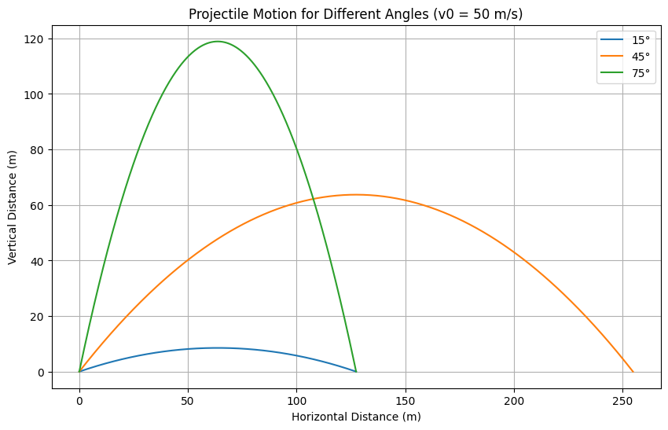
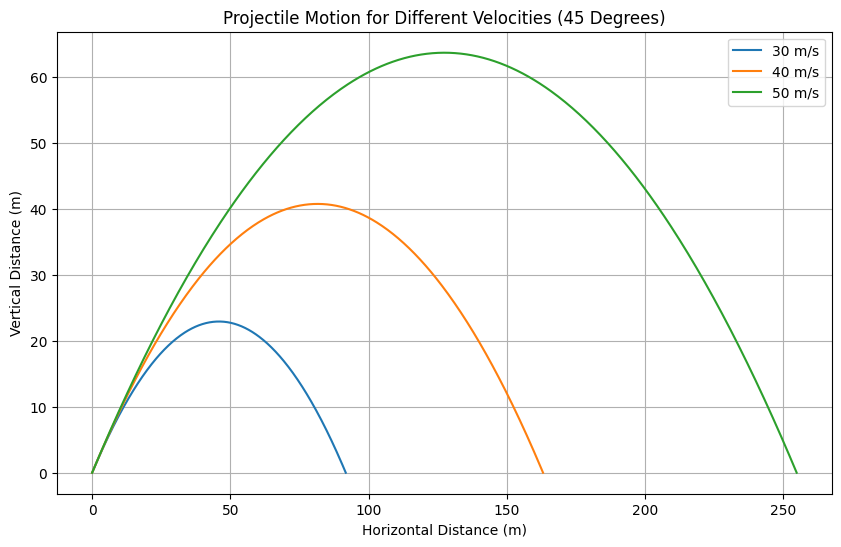

# Problem 1
# Investigating the Range as a Function of the Angle of Projection

## Motivation

Projectile motion, though elementary in its structure, provides a substantial basis for studying foundational physical laws. The investigation of how a projectile's range depends on the angle of projection brings together both theoretical and practical insights. This exploration involves not only basic trigonometry and calculus but also reflects a wide variety of real-world applications ranging from sports to aerospace dynamics.

## 1. Theoretical Foundation

Projectile motion can be described by Newton's second law and the kinematic equations. Assuming no air resistance, the only force acting on the object (after it's projected) is gravity.

### Governing Equations

The equations of motion in the x and y directions can be derived from:

$ \frac{d^2x}{dt^2} = 0 \Rightarrow x(t) = v_0 \cos(\theta) t $

$ \frac{d^2y}{dt^2} = -g \Rightarrow y(t) = v_0 \sin(\theta) t - \frac{1}{2}gt^2 $

Where:
- $ v_0 $: Initial velocity
- $ \theta $: Launch angle
- $ g $: Acceleration due to gravity ($9.81\ m/s^2$)
- $ t $: Time

### Time of Flight

The time at which the projectile returns to the same vertical level is:
$$ T = \frac{2v_0\sin(\theta)}{g} $$

### Range

The horizontal range ($R$) of the projectile is given by:
$$ R = \frac{v_0^2\sin(2\theta)}{g} $$

This shows the range is maximum when $ \theta = 45^\circ $.

## 2. Analysis of the Range

The horizontal range varies as a function of the angle of projection:
- At $\theta = 0^\circ$ or $\theta = 90^\circ$, range is zero.  
- Maximum range occurs at $45^\circ$  
- Range is symmetric about $45^\circ$
### Influence of Parameters:
- **Initial velocity**: Quadratically proportional to range.
- **Gravity**: Inversely proportional to range.
- **Angle**: Influences both the vertical and horizontal motion.

## 3. Practical Applications

- **Sports**: Understanding how to optimize angle and force for maximum throw or jump.
- **Ballistics**: Predicting the path of projectiles with drag.
- **Engineering**: Simulations of component launches or material drops.
- **Astrophysics**: Modeling the launch paths of satellites with corrections.

## 4. Implementation in Python

Below is Python code to simulate projectile motion with different angles and velocities.

### A. Plot for 50 m/s and Angles 15, 45, 75 Degrees

```python
import numpy as np
import matplotlib.pyplot as plt

def projectile(v0, theta_deg):
    g = 9.81
    theta = np.radians(theta_deg)
    t_flight = 2 * v0 * np.sin(theta) / g
    t = np.linspace(0, t_flight, num=500)
    x = v0 * np.cos(theta) * t
    y = v0 * np.sin(theta) * t - 0.5 * g * t**2
    return x, y

angles = [15, 45, 75]
plt.figure(figsize=(10,6))
for angle in angles:
    x, y = projectile(50, angle)
    plt.plot(x, y, label=f'{angle}\u00b0')
plt.title('Projectile Motion for Different Angles (v0 = 50 m/s)')
plt.xlabel('Horizontal Distance (m)')
plt.ylabel('Vertical Distance (m)')
plt.legend()
plt.grid()
plt.show()
```

---
### B. Plot for Velocities 30, 40, 50 m/s at 45 Degrees

```python
velocities = [30, 40, 50]
plt.figure(figsize=(10,6))
for v in velocities:
    x, y = projectile(v, 45)
    plt.plot(x, y, label=f'{v} m/s')
plt.title('Projectile Motion for Different Velocities (45 Degrees)')
plt.xlabel('Horizontal Distance (m)')
plt.ylabel('Vertical Distance (m)')
plt.legend()
plt.grid()
plt.show()
```


## Range Visualization and Effects

These plots visually confirm:
- Greater velocity leads to higher and farther motion.
- Angle significantly affects maximum height and range.

## Limitations and Extensions

This model does not account for:
- **Air resistance**: Causes asymmetry and shorter range.
- **Wind**: Alters trajectory path.
- **Launch height**: If not from ground level, modifies equations.

Extensions can include solving differential equations with drag force:
$$ \vec{F} = -kv\vec{v} \quad \text{(linear drag)} $$
