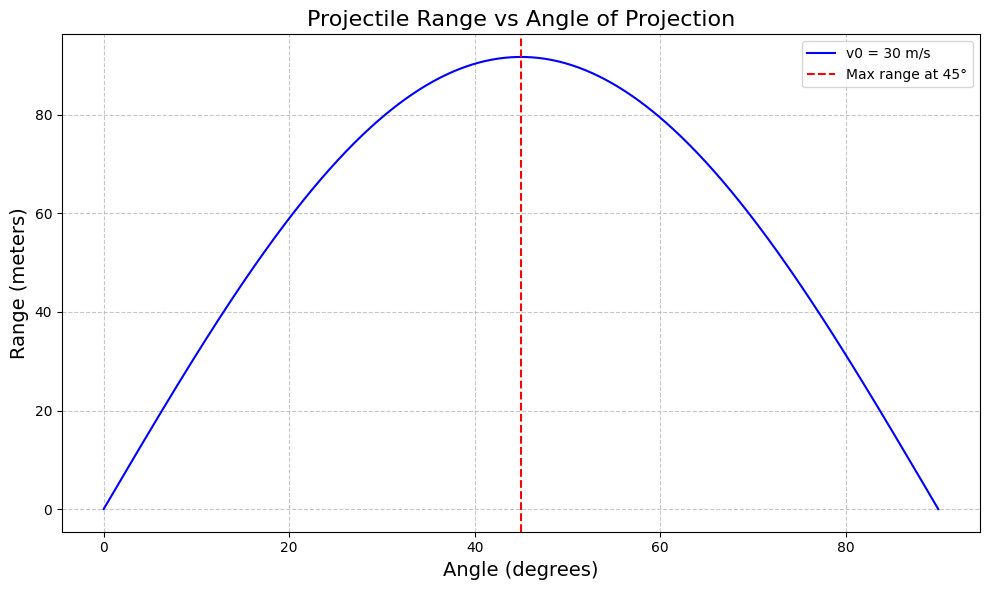

# Problem 1

# Problem 1: Investigating the Range as a Function of the Angle of Projection

## 1. Theoretical Foundation

Projectile motion is governed by Newton's laws and can be modeled by decomposing the motion into horizontal and vertical components.

Given:
- Initial velocity: $$v_0$$
- Angle of projection: $$\theta$$
- Gravitational acceleration: $$g$$

The equations of motion in a vacuum and with no air resistance are:

- Horizontal displacement:
  $$
  x(t) = v_0 \cos(\theta) \cdot t
  $$

- Vertical displacement:
  $$
  y(t) = v_0 \sin(\theta) \cdot t - \frac{1}{2} g t^2
  $$

The time of flight is obtained by solving $$y(t) = 0$$:

$$
t_{total} = \frac{2 v_0 \sin(\theta)}{g}
$$

Using this, the **range** (horizontal distance traveled before hitting the ground) is:

$$
R = v_0 \cos(\theta) \cdot t_{total} = \frac{v_0^2 \sin(2\theta)}{g}
$$

This equation shows a **nonlinear** dependence on angle, with a **maximum range at** $$\theta = 45^\circ$$ for ideal conditions.

---

## 2. Analysis of the Range

We analyze the range $$R$$ as a function of the angle of projection $$\theta$$ using:

$$
R(\theta) = \frac{v_0^2 \sin(2\theta)}{g}
$$

- **Max range:** Occurs when $$\sin(2\theta) = 1$$, i.e., $$\theta = 45^\circ$$.
- **Effect of velocity:** Range increases quadratically with initial velocity.
- **Effect of gravity:** Range decreases inversely with gravitational acceleration.

---

## 3. Practical Applications

In real-world situations:
- **Air resistance** reduces range and shifts optimal angle < $$45^\circ$$.
- **Uneven terrain** alters landing height, changing total time of flight.
- **Wind** can either assist or hinder horizontal displacement.
- Applications include sports (e.g., basketball, soccer), military ballistics, and spaceflight trajectory planning.

---

## 4. Implementation

Below is a Python implementation to visualize how the range depends on the angle of projection.

### Python Code

```python
import numpy as np
import matplotlib.pyplot as plt

# Constants
g = 9.81  # m/s^2
v0 = 30   # m/s (initial velocity)

# Angle values from 0° to 90°
angles_deg = np.linspace(0, 90, 500)
angles_rad = np.radians(angles_deg)

# Compute range for each angle
ranges = (v0**2 * np.sin(2 * angles_rad)) / g

# Plotting
plt.figure(figsize=(10, 6))
plt.plot(angles_deg, ranges, color='blue', label=f'v0 = {v0} m/s')
plt.axvline(45, color='red', linestyle='--', label='Max range at 45°')
plt.title('Projectile Range vs Angle of Projection', fontsize=16)
plt.xlabel('Angle (degrees)', fontsize=14)
plt.ylabel('Range (meters)', fontsize=14)
plt.grid(True, linestyle='--', alpha=0.7)
plt.legend()
plt.tight_layout()
plt.show()
```

