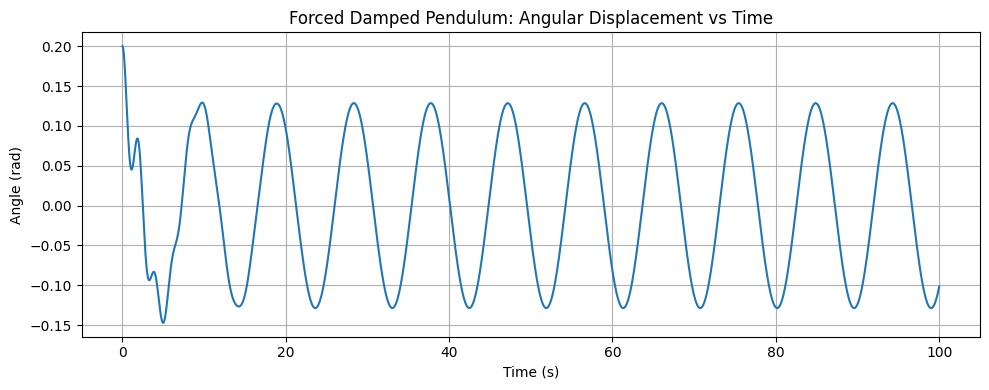

# Problem 2 

# Investigating the Dynamics of a Forced Damped Pendulum

---

## 1. Theoretical Foundation

The forced damped pendulum is a nonlinear oscillator that exhibits rich dynamical behavior. It is modeled by the second-order nonlinear differential equation:

$$
\frac{d^2\theta}{dt^2} + b\frac{d\theta}{dt} + \frac{g}{L} \sin\theta = A \cos(\omega t)
$$

where:

- $\theta(t)$: Angular displacement (radians)
- $b$: Damping coefficient
- $g$: Gravitational acceleration
- $L$: Length of the pendulum
- $A$: Amplitude of the driving force
- $\omega$: Frequency of the driving force

This equation combines restoring force ($\sin\theta$), linear damping ($b \, d\theta/dt$), and a periodic driving force ($A \cos(\omega t)$).

### 1.1 Linearization for Small Angles

For small oscillations, where $\theta \ll 1$, we can use the approximation:

$$
\sin\theta \approx \theta
$$

The equation becomes:

$$
\frac{d^2\theta}{dt^2} + b\frac{d\theta}{dt} + \frac{g}{L}\theta = A\cos(\omega t)
$$

This is the classic linear driven damped harmonic oscillator equation.

### 1.2 Resonance Behavior

In steady-state, the solution for $\theta(t)$ takes the form:

$$
\theta(t) = \Theta \cos(\omega t - \delta)
$$

where:

- $\Theta$: Amplitude of oscillation
- $\delta$: Phase shift

The amplitude is given by:

$$
\Theta(\omega) = \frac{A}{\sqrt{ \left( \frac{g}{L} - \omega^2 \right)^2 + (b\omega)^2 }}
$$

This amplitude is maximized when $\omega \approx \sqrt{g/L}$, the natural frequency of the undamped pendulum, i.e., **resonance** occurs when the driving frequency matches the natural frequency.

---

## 2. Analysis of Dynamics

Unlike the linear approximation, the full nonlinear equation (with $\sin\theta$ intact) exhibits complex behavior including:

- **Periodic motion**
- **Quasiperiodic motion**
- **Chaotic behavior**

These depend sensitively on parameters $A$, $b$, and $\omega$.

### 2.1 Parameter Effects

- **Damping ($b$)**: High damping suppresses motion; low damping allows oscillations and chaos.
- **Driving Amplitude ($A$)**: Larger $A$ can push the system into chaos.
- **Driving Frequency ($\omega$)**: Influences resonance and period-doubling bifurcations.

### 2.2 Chaos and Nonlinearity

For sufficiently large $A$ and small $b$, the motion becomes unpredictable. Small changes in initial conditions result in drastically different outcomes—a hallmark of **chaos**.

- **Phase diagrams** show the evolution of $(\theta, \dot{\theta})$.
- **Poincaré sections** sample the system at regular intervals (e.g., each period $T = 2\pi/\omega$).
- **Bifurcation diagrams** show how the long-term behavior changes with $A$ or $\omega$.

---

## 3. Practical Applications

The forced damped pendulum is a model for many real systems:

- **Energy harvesting**: Devices that convert mechanical vibration into electrical energy.
- **Mechanical systems**: Bridges and buildings under wind or seismic driving.
- **Electrical analogs**: Driven RLC circuits exhibit identical mathematical behavior.
- **Biological systems**: Models of cardiac rhythms and walking gait.

---

## 4. Computational Implementation

To simulate the full nonlinear dynamics, we solve the second-order ODE numerically using the Runge-Kutta method.

### 4.1 Python Code

```python
import numpy as np
import matplotlib.pyplot as plt
from scipy.integrate import solve_ivp

# Parameters
g = 9.81      # gravity (m/s^2)
L = 1.0       # length of pendulum (m)
b = 0.5       # damping coefficient
A = 1.2       # driving amplitude
omega = 2/3   # driving frequency

# Time span
t_span = (0, 100)
t_eval = np.linspace(*t_span, 5000)

# ODE function
def pendulum(t, y):
    theta, omega_theta = y
    dtheta_dt = omega_theta
    domega_dt = -b * omega_theta - (g/L) * np.sin(theta) + A * np.cos(omega * t)
    return [dtheta_dt, domega_dt]

# Initial conditions
theta0 = 0.2
omega0 = 0.0
sol = solve_ivp(pendulum, t_span, [theta0, omega0], t_eval=t_eval)

# Plot time series
plt.figure(figsize=(10, 4))
plt.plot(sol.t, sol.y[0])
plt.title("Forced Damped Pendulum: Angular Displacement vs Time")
plt.xlabel("Time (s)")
plt.ylabel("Angle (rad)")
plt.grid(True)
plt.tight_layout()
plt.show()
```
