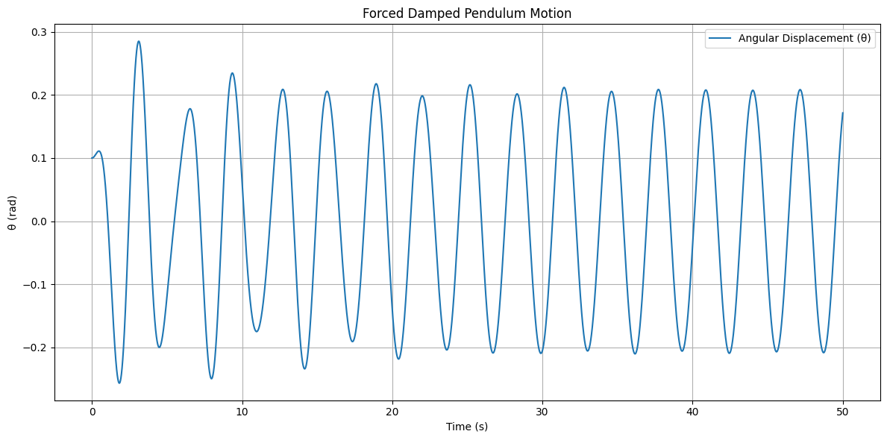

# Problem 2 

# Investigating the Dynamics of a Forced Damped Pendulum

## 1. Theoretical Foundation

The equation governing the motion of a forced damped pendulum is:

$$
\frac{d^2\theta}{dt^2} + b\frac{d\theta}{dt} + \frac{g}{L}\sin\theta = A\cos(\omega t)
$$

Where:
- \theta(t) is the angular displacement,
- $b$ is the damping coefficient,
- $g$ is gravitational acceleration,
- $L$ is the length of the pendulum,
- $A$ is the amplitude of the driving force,
- $\omega$ is the frequency of the driving force.

### Small-Angle Approximation

For small angles, we can use the approximation:

$$
\sin\theta \approx \theta
$$

Then the linearized equation becomes:

$$
\frac{d^2\theta}{dt^2} + b\frac{d\theta}{dt} + \frac{g}{L}\theta = A\cos(\omega t)
$$

This is a second-order linear differential equation with forcing and damping, analogous to the driven damped harmonic oscillator. The solution generally includes:
- A transient component (decaying),
- A steady-state component with the same frequency as the driving force.

### Resonance

Resonance occurs when the driving frequency $$\omega$$ is close to the natural frequency:

$$
\omega_0 = \sqrt{\frac{g}{L}}
$$

The response amplitude increases dramatically if damping is small.

---

## 2. Analysis of Dynamics

To explore full nonlinear behavior, including chaotic dynamics, we must numerically integrate the original equation without small-angle approximation.

The effects of parameters:
- **Damping** ($$b$$): controls how quickly energy is lost.
- **Driving Amplitude** ($$A$$): higher amplitude may trigger chaotic responses.
- **Driving Frequency** ($$\omega$$): near-resonant values increase system energy.

**Transitions:**
- **Low $$A$$ and $$b$$**: periodic motion.
- **Moderate $$A$$**: quasiperiodic.
- **High $$A$$**: chaotic motion.

---

## 3. Practical Applications

The forced damped pendulum appears in:
- Energy harvesting systems (vibrating beams or pendulums),
- Suspension bridges (wind-induced oscillations),
- Electrical analogs like RLC circuits,
- Human movement dynamics (e.g., arm swinging),
- Earth’s climate cycles (e.g., Milankovitch cycles).

---

## 4. Implementation

Below is the Python simulation using the Runge-Kutta method for solving the nonlinear ODE.

```python
import numpy as np
import matplotlib.pyplot as plt
from scipy.integrate import solve_ivp

# Parameters
g = 9.81       # gravity (m/s^2)
L = 1.0        # pendulum length (m)
b = 0.2        # damping coefficient
A = 1.2        # driving force amplitude
omega = 2.0    # driving frequency (rad/s)

# Time setup
t_span = (0, 50)
t_eval = np.linspace(*t_span, 10000)

# Differential equation system
def pendulum(t, y):
    theta, omega_ = y
    dtheta_dt = omega_
    domega_dt = -b * omega_ - (g / L) * np.sin(theta) + A * np.cos(omega * t)
    return [dtheta_dt, domega_dt]

# Initial conditions: [theta_0, omega_0]
y0 = [0.1, 0.0]

# Solve ODE
sol = solve_ivp(pendulum, t_span, y0, t_eval=t_eval, method='RK45')

# Extract results
theta = sol.y[0]
omega_ = sol.y[1]
time = sol.t

# Plot results
plt.figure(figsize=(12, 6))
plt.plot(time, theta, label='Angular Displacement (θ)')
plt.xlabel('Time (s)')
plt.ylabel('θ (rad)')
plt.title('Forced Damped Pendulum Motion')
plt.grid(True)
plt.legend()
plt.tight_layout()
plt.show()
```

