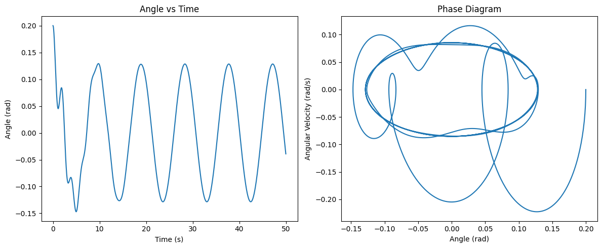
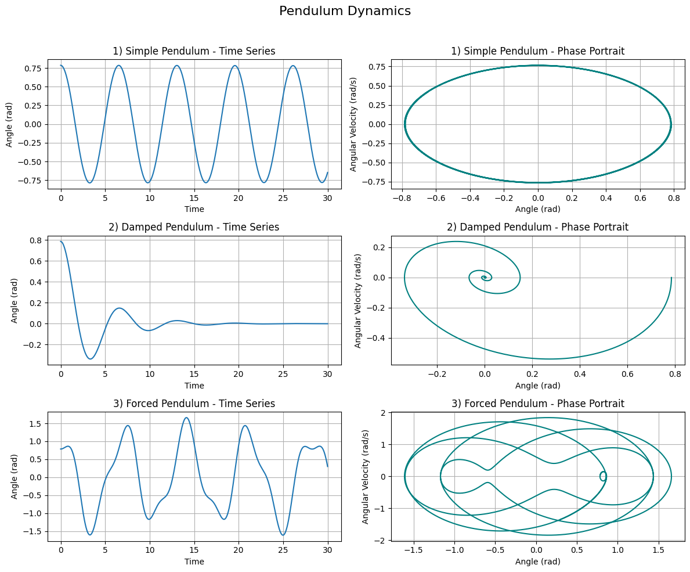

# Problem 2 

# Investigating the Dynamics of a Forced Damped Pendulum

## Motivation

The forced damped pendulum is a fascinating dynamical system that demonstrates a wide range of behaviors from simple harmonic motion to complex chaos. This transition occurs due to the interplay between natural oscillatory forces, damping mechanisms, and external periodic forces. This system provides a classical example for studying phenomena like resonance, energy dissipation, and chaotic dynamics, which are prevalent in many real-world systems such as suspension bridges, climate oscillations, and electronic circuits.

## 1. Theoretical Foundation

We begin with the second-order nonlinear differential equation governing a forced damped pendulum:

$$
\frac{d^2 \theta}{dt^2} + b\frac{d\theta}{dt} + \frac{g}{L}\sin(\theta) = A\cos(\omega t)
$$

Where:
- $\theta$ is the angular displacement
- $b$ is the damping coefficient
- $g$ is the gravitational acceleration
- $L$ is the length of the pendulum
- $A$ is the amplitude of the external forcing
- $\omega$ is the driving frequency

### Small-Angle Approximation

For small oscillations, $\sin(\theta) \approx \theta$, and the equation simplifies to:

$$
\frac{d^2 \theta}{dt^2} + b\frac{d\theta}{dt} + \frac{g}{L}\theta = A\cos(\omega t)
$$

This is a linear differential equation that resembles the driven damped harmonic oscillator.

## 2. Analysis of Dynamics

### Pure Pendulum (No damping or forcing)
$$
\frac{d^2 \theta}{dt^2} + \frac{g}{L}\sin(\theta) = 0
$$

### Damped Pendulum (With damping, no forcing)
$$
\frac{d^2 \theta}{dt^2} + b\frac{d\theta}{dt} + \frac{g}{L}\sin(\theta) = 0
$$

### Driven Undamped Pendulum (With forcing, no damping)
$$
\frac{d^2 \theta}{dt^2} + \frac{g}{L}\sin(\theta) = A\cos(\omega t)
$$

### Forced Damped Pendulum (Full model)
$$
\frac{d^2 \theta}{dt^2} + b\frac{d\theta}{dt} + \frac{g}{L}\sin(\theta) = A\cos(\omega t)
$$

## 3. Practical Applications

- **Mechanical Engineering**: Suspension systems, rotating machinery
- **Electrical Engineering**: Analogies to driven RLC circuits
- **Biomechanics**: Modeling of human gait or limb movements under periodic stimulus
- **Climate Science**: Oscillatory climate models (e.g., El Nino cycles)

## 4. Implementation

We use Python to simulate the system dynamics using the Runge-Kutta method. We visualize the angle vs. time, phase portraits, and explore chaotic behavior and resonance.

---

### Python Code for Simulation


```python
import numpy as np
import matplotlib.pyplot as plt
from scipy.integrate import solve_ivp

# Constants
g = 9.81      # gravity (m/s^2)
L = 1.0       # length of pendulum (m)
b = 0.5       # damping coefficient
A = 1.2       # amplitude of external force
omega = 2/3   # frequency of external force

def pendulum(t, y):
    theta, omega_theta = y
    dtheta_dt = omega_theta
    domega_dt = -b * omega_theta - (g / L) * np.sin(theta) + A * np.cos(omega * t)
    return [dtheta_dt, domega_dt]

# Initial conditions and time span
y0 = [0.2, 0.0]  # initial angle and angular velocity
t_span = (0, 50)
t_eval = np.linspace(t_span[0], t_span[1], 5000)

# Solve the system
sol = solve_ivp(pendulum, t_span, y0, t_eval=t_eval, method='RK45')

# Plot Angle vs. Time
plt.figure(figsize=(12, 5))
plt.subplot(1, 2, 1)
plt.plot(sol.t, sol.y[0])
plt.title('Angle vs Time')
plt.xlabel('Time (s)')
plt.ylabel('Angle (rad)')

# Phase Portrait
plt.subplot(1, 2, 2)
plt.plot(sol.y[0], sol.y[1])
plt.title('Phase Diagram')
plt.xlabel('Angle (rad)')
plt.ylabel('Angular Velocity (rad/s)')

plt.tight_layout()
plt.show()
```
 


---

## Advanced Analysis

We can extend the model further to include:
- **Poincaré Sections**: by sampling state variables at intervals of the driving period
- **Bifurcation Diagrams**: by sweeping over $A$ or $\omega$
- **Lyapunov Exponents**: to detect chaotic dynamics

## Conclusion

The forced damped pendulum is a powerful model capturing fundamental and complex behavior in physics. Through theoretical derivations and computational simulations, we observe transitions from order to chaos, and understand deeper mechanisms underlying many real-world dynamic systems.
