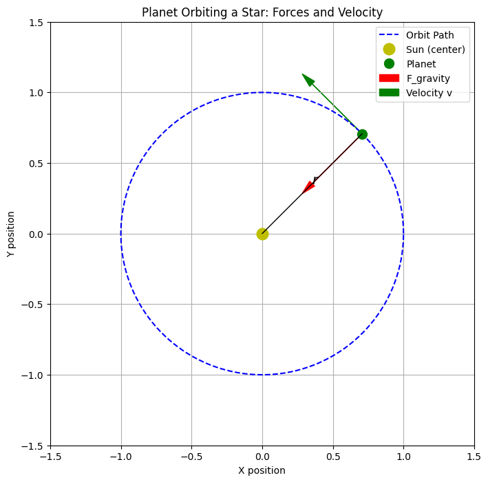

# Problem 1 


# Orbital Period and Orbital Radius  
## Derivation, Simulation, and Application of Kepler's Third Law

---

## 1. Introduction

The relationship between the orbital period $T$ and the orbital radius $r$ of celestial bodies is described by **Kepler's Third Law**.  
It was later derived using **Newton's Law of Gravitation**, providing a deep connection between gravity and orbital motion.

In this document, we:
- Derive the relationship mathematically,
- Simulate the relation using planetary data,
- Calculate the mass of the Earth and Sun using Kepler’s Law,
- Discuss the law's application to elliptical orbits.

---

## 2. Derivation of Kepler’s Third Law for Circular Orbits

Starting with **Newton’s Law of Gravitation**:

$$
F_{\text{gravity}} = \frac{G M m}{r^2}
$$

The centripetal force needed for circular motion is:

$$
F_{\text{centripetal}} = \frac{m v^2}{r}
$$

Setting them equal (gravity provides centripetal force):

$$
\frac{G M m}{r^2} = \frac{m v^2}{r}
$$

Simplifying:

$$
v^2 = \frac{G M}{r}
$$

The orbital period $T$ relates to velocity $v$ by:

$$
v = \frac{2\pi r}{T}
$$

Substituting:

$$
\left( \frac{2\pi r}{T} \right)^2 = \frac{G M}{r}
$$

Expanding:

$$
\frac{4\pi^2 r^2}{T^2} = \frac{G M}{r}
$$

Multiplying both sides by $r$:

$$
4\pi^2 r^3 = G M T^2
$$

Finally, solving for $T^2$:

$$
T^2 = \frac{4\pi^2}{G M} r^3
$$

Thus:

$$
\boxed{T^2 \propto r^3}
$$



---

## 3. Simulation and Plotting $T^2$ vs $r^3$

We verify the relationship using planetary data (Mercury, Venus, Earth, Mars).

---

### 3.1 Python Code

```python
# Import necessary libraries
import numpy as np
import matplotlib.pyplot as plt

# Planetary data
planets = ['Mercury', 'Venus', 'Earth', 'Mars']
r_AU = np.array([0.387, 0.723, 1.000, 1.524])  # Orbital radii (AU)
T_years = np.array([0.241, 0.615, 1.000, 1.881])  # Orbital periods (years)

# Compute r^3 and T^2
r_cubed = r_AU**3
T_squared = T_years**2

# Plotting
plt.figure(figsize=(8,6))
plt.plot(r_cubed, T_squared, 'o-', color='blue', markersize=8)
for i, planet in enumerate(planets):
    plt.text(r_cubed[i]*1.02, T_squared[i]*0.98, planet, fontsize=10)

plt.xlabel(r"$r^3$ (AU$^3$)", fontsize=14)
plt.ylabel(r"$T^2$ (years$^2$)", fontsize=14)
plt.title(r"Kepler's Third Law: $T^2$ vs $r^3$", fontsize=16)
plt.grid(True)
plt.show()
```

---

### 3.2 Interpretation

The plot of $T^2$ against $r^3$ is a **straight line**, confirming that $T^2 \propto r^3$.  
This matches the theoretical derivation and validates **Kepler’s Third Law**.

---

## 4. Applications: Mass Calculations

### 4.1 Finding the Mass of the Sun

Using Earth's orbit:

- Orbital radius: $r = 1.496 \times 10^{11}\ \text{m}$
- Orbital period: $T = 3.154 \times 10^{7}\ \text{s}$

The mass of the Sun is given by:

$$
M = \frac{4\pi^2 r^3}{G T^2}
$$

where $G = 6.67430 \times 10^{-11}\ \text{m}^3 \text{kg}^{-1} \text{s}^{-2}$.

---

### Code to Find Mass of Sun

```python
# Constants
G = 6.67430e-11  # Gravitational constant (m^3/kg/s^2)
r_earth = 1.496e11  # Orbital radius of Earth (m)
T_earth = 3.154e7   # Orbital period of Earth (s)

# Calculate Mass of Sun
M_sun = (4 * np.pi**2 * r_earth**3) / (G * T_earth**2)
print(f"Mass of the Sun = {M_sun:.3e} kg")
```

**Result:**  
Mass of the Sun $\approx 1.99 \times 10^{30}\ \text{kg}$

---

### 4.2 Finding the Mass of the Earth

Using the Moon's orbit:

- Orbital radius: $r = 3.844 \times 10^{8}\ \text{m}$
- Orbital period: $T = 2.3606 \times 10^{6}\ \text{s}$

---

### Code to Find Mass of Earth

```python
# Moon orbit data
r_moon = 3.844e8  # Orbital radius of Moon (m)
T_moon = 2.3606e6  # Orbital period of Moon (s)

# Calculate Mass of Earth
M_earth = (4 * np.pi**2 * r_moon**3) / (G * T_moon**2)
print(f"Mass of the Earth = {M_earth:.3e} kg")
```

**Result:**  
Mass of the Earth $\approx 5.97 \times 10^{24}\ \text{kg}$

---

## 5. Extension: Elliptical Orbits

For elliptical orbits, Kepler’s Third Law becomes:

$$
T^2 = \frac{4\pi^2}{G M} a^3
$$

where $a$ is the **semi-major axis** of the ellipse.

Thus, $T^2$ is proportional to $a^3$ even for non-circular (elliptical) orbits.


