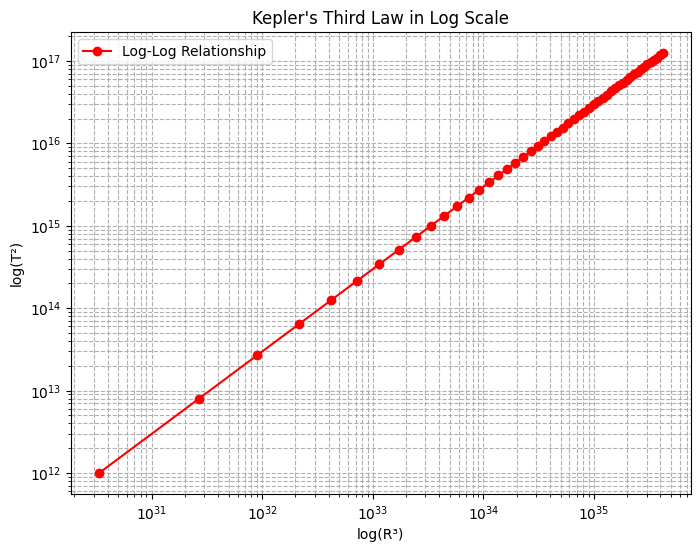

# Problem 2

#  Escape and Cosmic Velocities

## Introduction

Cosmic velocities define the speed thresholds required to:

1. **Stay in orbit** – First Cosmic Velocity
2. **Escape the planet's gravity** – Second Cosmic Velocity
3. **Escape the solar system** – Third Cosmic Velocity

These principles are fundamental in spaceflight mechanics and interplanetary mission planning.

---

## 1. Derivation of Cosmic Velocities

### 🛰 First Cosmic Velocity ($v_1$)

The first cosmic velocity is the **minimum speed needed to orbit a celestial body** near its surface in a circular orbit.

From Newton’s gravitational force and centripetal force balance:

$$
\frac{G M m}{R^2} = \frac{m v_1^2}{R}
$$

Simplifying:

$$
v_1 = \sqrt{\frac{G M}{R}}
$$

---

###  Second Cosmic Velocity ($v_2$)

This is the **escape velocity**, i.e., the velocity needed to completely escape the gravitational field of a planet.

From conservation of energy:

$$
\frac{1}{2} m v_2^2 = \frac{G M m}{R}
$$

Therefore:

$$
v_2 = \sqrt{\frac{2 G M}{R}} = \sqrt{2} \cdot v_1
$$

---

###  Third Cosmic Velocity ($v_3$)

This is the **minimum speed required to escape the Sun's gravitational pull** from Earth’s orbit.

Using Pythagoras-like relation:

$$
v_3 = \sqrt{v_{\text{esc, Earth}}^2 + v_{\text{orbit around Sun}}^2}
$$

Where:
- $v_{\text{esc, Earth}} \approx 11.2 \, \text{km/s}$
- $v_{\text{orbit around Sun}} \approx 29.78 \, \text{km/s}$

Then:

$$
v_3 \approx \sqrt{(11.2)^2 + (29.78)^2} \approx 42.1 \, \text{km/s}
$$

---

## 2. Earth Cosmic Velocity Values

| Velocity Type          | Formula                         | Value (Earth)       |
|------------------------|----------------------------------|---------------------|
| First Cosmic Velocity  | $v_1 = \sqrt{\frac{G M}{R}}$     | $\approx 7.91$ km/s |
| Second Cosmic Velocity | $v_2 = \sqrt{\frac{2 G M}{R}}$   | $\approx 11.2$ km/s |
| Third Cosmic Velocity  | $v_3 = \sqrt{v_1^2 + v_{\text{orbit}}^2}$ | $\approx 42.1$ km/s |

---

## 3. Comparison with Moon, Mars, Jupiter

```python
import numpy as np
import matplotlib.pyplot as plt

# Constants
G = 6.67430e-11  # Gravitational constant in m^3 kg^-1 s^-2

# Mass (kg) and Radius (m) for each body
bodies = {
    "Moon":     [7.35e22, 1.74e6],
    "Earth":    [5.97e24, 6.37e6],
    "Mars":     [6.42e23, 3.39e6],
    "Jupiter":  [1.90e27, 6.99e7]
}

# Calculate v1 and v2 for each body
results = {}
for name, (M, R) in bodies.items():
    v1 = np.sqrt(G * M / R) / 1000  # Convert to km/s
    v2 = np.sqrt(2 * G * M / R) / 1000
    results[name] = (v1, v2)

# Prepare data
labels = list(results.keys())
v1_vals = [results[body][0] for body in labels]
v2_vals = [results[body][1] for body in labels]

# Plot
x = np.arange(len(labels))
width = 0.35

fig, ax = plt.subplots(figsize=(10, 6))
ax.bar(x - width/2, v1_vals, width, label='v1 (Orbital)')
ax.bar(x + width/2, v2_vals, width, label='v2 (Escape)')

ax.set_ylabel('Velocity (km/s)')
ax.set_title('Cosmic Velocities for Celestial Bodies')
ax.set_xticks(x)
ax.set_xticklabels(labels)
ax.legend()
plt.grid(True)
plt.tight_layout()
plt.show()
```

---

###  Summary Table

| Body     | $v_1$ (km/s) | $v_2$ (km/s) |
|----------|--------------|--------------|
| Moon     | $\approx 1.68$  | $\approx 2.38$  |
| Earth    | $\approx 7.91$  | $\approx 11.2$  |
| Mars     | $\approx 3.55$  | $\approx 5.02$  |
| Jupiter  | $\approx 42.0$  | $\approx 59.5$  |

---

##  Applications in Space Science

- **$v_1$**: Needed for low-Earth orbit satellites (e.g., ISS).
- **$v_2$**: Required for missions to the Moon, Mars, or other planets.
- **$v_3$**: Needed for deep-space probes like *Voyager* or *Pioneer* missions.

---