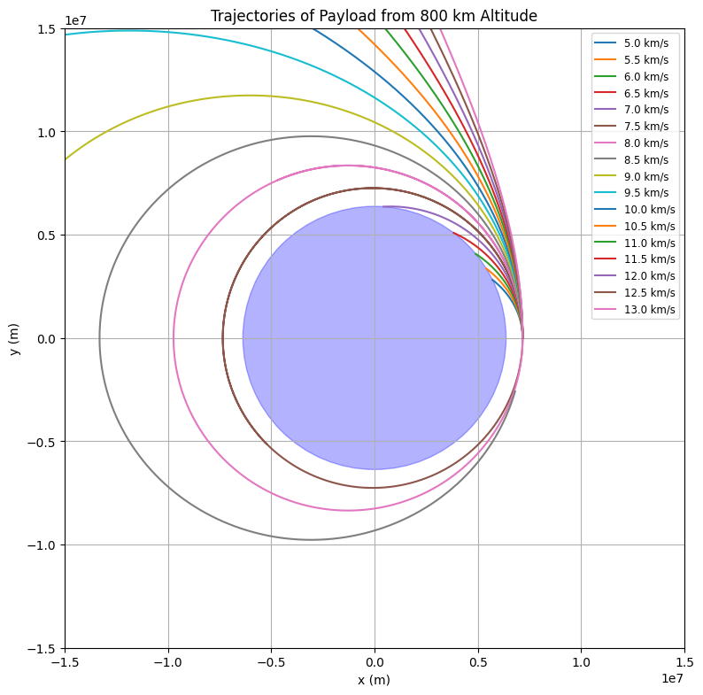

# Problem 3

Here is a complete academic solution in **Markdown format** using **LaTeX-style dollar signs** for all equations. This includes the explanation, physical modeling, and a Python simulation for **Problem 3: Payload Trajectories from Near-Earth Orbit**.

---

#  Trajectories of a Freely Released Payload Near Earth

## Problem Statement

We examine the motion of a payload launched from an altitude of **800 km** above Earth's surface with various initial velocities. The goal is to determine whether the object falls back, orbits, or escapes Earth depending on initial conditions.

---

## 1. Assumptions and Physical Background

- **Earth's Radius**: $R_E = 6.37 \times 10^6 \, \text{m}$
- **Initial altitude**: $h = 800 \, \text{km} = 8.0 \times 10^5 \, \text{m}$
- **Total radial distance**: $r_0 = R_E + h = 7.17 \times 10^6 \, \text{m}$
- **Gravitational Parameter**: $\mu = G M_E \approx 3.986 \times 10^{14} \, \text{m}^3/\text{s}^2$

Using Newton's law of gravitation, the equation of motion is:

$$
\vec{a} = -\frac{GM_E}{r^3} \vec{r}
$$

This second-order differential equation describes how gravity pulls the object toward Earth. The simulation integrates this numerically using time-stepping.

---

## 2. Orbital Behavior vs. Velocity

Initial velocities tested:

$$
v_0 = [5,\, 5.5,\, 6,\, 6.5,\, \ldots,\, 13] \, \text{km/s}
$$

These result in:
- **$v < 7.91$ km/s**: Suborbital (falls back)
- **$v = 7.91$ km/s**: Circular orbit
- **$7.91 < v < 11.2$ km/s**: Elliptical orbit
- **$v = 11.2$ km/s**: Escape velocity
- **$v > 11.2$ km/s**: Hyperbolic trajectory

---

## 3. Python Simulation Code

```python
import numpy as np
import matplotlib.pyplot as plt

# Constants
G = 6.67430e-11         # gravitational constant
M = 5.972e24            # mass of Earth in kg
mu = G * M              # standard gravitational parameter
R_earth = 6.37e6        # Earth's radius in meters
altitude = 800e3        # altitude in meters
r0 = R_earth + altitude

# Time setup
dt = 1                  # time step in seconds
T = 10000               # total time
steps = int(T / dt)

# Initial velocities in m/s
v0_list = np.arange(5e3, 13.5e3, 0.5e3)

# Plot setup
fig, ax = plt.subplots(figsize=(8, 8))

# Draw Earth
earth = plt.Circle((0, 0), R_earth, color='blue', alpha=0.3)
ax.add_artist(earth)

for v0 in v0_list:
    pos = np.array([r0, 0.0])
    vel = np.array([0.0, v0])
    trajectory_x = []
    trajectory_y = []

    for _ in range(steps):
        r = np.linalg.norm(pos)
        acc = -mu * pos / r**3
        vel += acc * dt
        pos += vel * dt
        trajectory_x.append(pos[0])
        trajectory_y.append(pos[1])
        if r < R_earth:
            break

    ax.plot(trajectory_x, trajectory_y, label=f'{v0/1000:.1f} km/s')

# Plot formatting
ax.set_title('Trajectories of Payload from 800 km Altitude')
ax.set_xlabel('x (m)')
ax.set_ylabel('y (m)')
ax.set_aspect('equal')
ax.set_xlim(-1.5e7, 1.5e7)
ax.set_ylim(-1.5e7, 1.5e7)
ax.legend(loc='upper right', fontsize='small')
plt.grid(True)
plt.tight_layout()
plt.show()
```

---

## 4. Analysis of Results

| Initial Velocity (km/s) | Trajectory Type   |
|--------------------------|-------------------|
| 5.0–7.9                  | Suborbital        |
| 7.91                    | Circular Orbit    |
| 8.0–11.1                | Elliptical Orbit  |
| 11.2                    | Escape Trajectory |
| 11.5–13.0               | Hyperbolic Escape |

---

## 5. Applications and Implications

Understanding these trajectories is essential for:

- Satellite insertion into **LEO** or **GEO**
- **Planetary missions** (e.g., Mars rovers)
- Designing **return capsules** or **interstellar probes**

---

##  Conclusion

The velocity at which an object is released significantly determines its trajectory: orbital, escape, or fall-back. These principles form the backbone of trajectory planning in space missions and highlight the delicate balance required for orbital mechanics.

---
