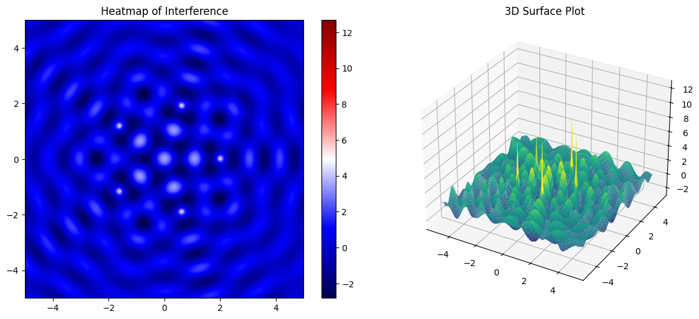
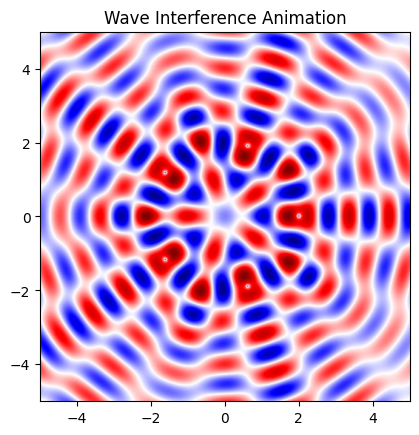

# Problem 1


#  Interference Patterns from Multiple Wave Sources

## Overview

This document presents a simulation of **interference patterns** generated by coherent point wave sources located on the vertices of regular polygons. We investigate how the **principle of superposition** affects wave propagation on a 2D water surface and visualize the resulting waveforms as **heatmaps** and **3D surface plots**. Finally, we produce **animated interference videos** that capture the wave dynamics over time.

---

## 1. Theoretical Background

A single wave from a point source is modeled by:

$$
\eta(x, y, t) = \frac{A}{\sqrt{r}} \cdot \cos(kr - \omega t + \phi)
$$

Where:
- $\eta(x, y, t)$ is the displacement at point $(x, y)$ at time $t$,
- $A$ is the wave amplitude,
- $r = \sqrt{(x - x_0)^2 + (y - y_0)^2}$ is the distance from the source $(x_0, y_0)$,
- $k = \frac{2\pi}{\lambda}$ is the wave number,
- $\omega = 2\pi f$ is the angular frequency,
- $\phi$ is the phase (set to 0 here for simplicity).

For $N$ sources at positions $\{(x_i, y_i)\}$, the total displacement is:

$$
\eta_{\text{sum}}(x, y, t) = \sum_{i=1}^{N} \frac{A}{\sqrt{r_i}} \cdot \cos(k r_i - \omega t)
$$

Where $r_i = \sqrt{(x - x_i)^2 + (y - y_i)^2}$.

---

## 2. Python Simulation

### Parameters

```python
import numpy as np
import matplotlib.pyplot as plt
import matplotlib.animation as animation

# Grid and time
x = np.linspace(-5, 5, 500)
y = np.linspace(-5, 5, 500)
X, Y = np.meshgrid(x, y)
t_vals = np.linspace(0, 2*np.pi, 60)

# Wave parameters
A = 1
wavelength = 1
frequency = 1
k = 2 * np.pi / wavelength
omega = 2 * np.pi * frequency

# Source configuration: Pentagon
def polygon_vertices(N, radius=2):
    return [(radius * np.cos(2 * np.pi * i / N), radius * np.sin(2 * np.pi * i / N)) for i in range(N)]

sources = polygon_vertices(5)  # Change to 1, 2, 3... for triangle, square, etc.
```

### Wave Function

```python
def interference_pattern(X, Y, t, sources):
    Z = np.zeros_like(X)
    for x0, y0 in sources:
        R = np.sqrt((X - x0)**2 + (Y - y0)**2) + 1e-6  # avoid div by zero
        Z += (A / np.sqrt(R)) * np.cos(k * R - omega * t)
    return Z
```

---

## 3. Visualization

### Static 2D and 3D Snapshots

```python
# Static at t = 0
Z = interference_pattern(X, Y, t=0, sources=sources)

fig = plt.figure(figsize=(12, 5))

# Heatmap
ax1 = fig.add_subplot(1, 2, 1)
c1 = ax1.imshow(Z, extent=(-5, 5, -5, 5), cmap='seismic')
ax1.set_title("Heatmap of Interference")
plt.colorbar(c1, ax=ax1)

# 3D surface
from mpl_toolkits.mplot3d import Axes3D
ax2 = fig.add_subplot(1, 2, 2, projection='3d')
ax2.plot_surface(X, Y, Z, cmap='viridis', rstride=5, cstride=5)
ax2.set_title("3D Surface Plot")

plt.tight_layout()
plt.show()
```

---

### Animated GIF Creation

```python
fig, ax = plt.subplots()
im = ax.imshow(np.zeros_like(X), extent=(-5, 5, -5, 5), cmap='seismic', vmin=-3, vmax=3)
ax.set_title("Wave Interference Animation")

def animate(t):
    Z = interference_pattern(X, Y, t, sources)
    im.set_array(Z)
    return [im]

ani = animation.FuncAnimation(fig, animate, frames=t_vals, interval=50, blit=True)
ani.save("interference.gif", writer='pillow')
```

---

## 4. Observations and Analysis

- **Single Source**: Produces symmetric, concentric waves with uniform intensity loss outward.
- **Two Sources**: Creates a clear pattern of **nodal (destructive)** and **antinodal (constructive)** lines, known as **interference fringes**.
- **Multiple Sources (Triangle, Pentagon, etc.)**: Introduces complex, symmetric interference patterns with highly structured nodal regions. These become increasingly intricate as the number of sources increases.

The coherence of sources ensures stable patterns. Incoherence would blur the interference.

---

## 5. Real-World Applications

- **Acoustics**: Understanding sound interference in auditoriums.
- **Optics**: Multi-slit experiments in wave-particle duality.
- **Telecommunications**: Antenna interference and phased arrays.
- **Fluid Mechanics**: Wave behavior in oceans and microfluidics.

---

##  Conclusion

This study provides both a mathematical and visual understanding of **wave interference** using multiple coherent point sources arranged on regular polygons. Such models are foundational for deeper insights in physics and engineering disciplines.
 