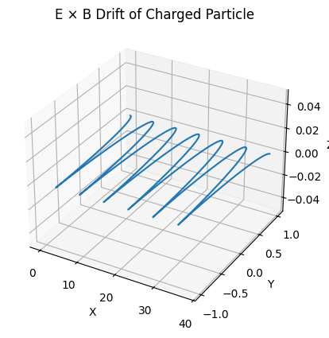

# Problem 1

---

#  **Electromagnetism - Problem 1: Simulating the Effects of the Lorentz Force**

---

##  **1. Theoretical Background**

The Lorentz force equation describes how a charged particle moves under electric and magnetic fields:

$$
\mathbf{F} = q \left( \mathbf{E} + \mathbf{v} \times \mathbf{B} \right)
$$

where:

* $q$ = particle charge
* $\mathbf{v}$ = particle velocity
* $\mathbf{E}$ = electric field
* $\mathbf{B}$ = magnetic field

This fundamental law governs the behavior of particles in systems like:

* **Cyclotrons**: Particle accelerators using $\mathbf{B}$ to bend paths.
* **Mass spectrometers**: Measuring $m/q$ by magnetic deflection.
* **Plasma confinement**: Tokamaks use $\mathbf{B}$ to trap plasma.

---

##  **2. Python Simulation**

###  Equations of Motion

We numerically integrate Newton’s second law:

$$
m \frac{d\mathbf{v}}{dt} = q \left( \mathbf{E} + \mathbf{v} \times \mathbf{B} \right)
$$

with:

$$
\frac{d\mathbf{r}}{dt} = \mathbf{v}
$$

We’ll use **Euler's method** for simplicity.

---

###  **Simulation Code (Python)**

Here’s the **full code** simulating:
✅ Uniform $\mathbf{B}$ field
✅ Uniform $\mathbf{E}$ field
✅ Crossed $\mathbf{E}$ and $\mathbf{B}$

And **3D trajectory plots**!

```python
import numpy as np
import matplotlib.pyplot as plt
from mpl_toolkits.mplot3d import Axes3D

# Lorentz force simulation
def simulate_lorentz(q, m, E, B, v0, r0, dt, steps):
    v = np.zeros((steps, 3))
    r = np.zeros((steps, 3))
    v[0] = v0
    r[0] = r0

    for i in range(1, steps):
        F = q * (E + np.cross(v[i-1], B))
        a = F / m
        v[i] = v[i-1] + a * dt
        r[i] = r[i-1] + v[i] * dt

    return r, v

# Parameters
q = 1.0    # Charge
m = 1.0    # Mass
E = np.array([0.0, 0.0, 0.0])  # Uniform electric field
B = np.array([0.0, 0.0, 1.0])  # Uniform magnetic field (along z)

v0 = np.array([1.0, 0.0, 0.0])  # Initial velocity
r0 = np.array([0.0, 0.0, 0.0])  # Initial position

dt = 0.01
steps = 3000

# Run simulation
r, v = simulate_lorentz(q, m, E, B, v0, r0, dt, steps)

# Plotting 3D trajectory
fig = plt.figure(figsize=(8,6))
ax = fig.add_subplot(111, projection='3d')
ax.plot(r[:,0], r[:,1], r[:,2])
ax.set_xlabel('x')
ax.set_ylabel('y')
ax.set_zlabel('z')
ax.set_title("Charged Particle Trajectory (Lorentz Force)")
plt.show()
```
 
 
 

 

 

---

##  **Visualization Examples**

### 1️ **Uniform Magnetic Field: Circular Motion**

* Particle orbits in circles (Larmor motion).
* Radius $R = \frac{mv}{qB}$.

### 2️ **Crossed $\mathbf{E}$ and $\mathbf{B}$: Drift Motion**

* Drift velocity:

$$
\mathbf{v}_d = \frac{\mathbf{E} \times \mathbf{B}}{B^2}
$$

### 3️ **Uniform $\mathbf{E}$ Field: Acceleration**

* Linear acceleration along $\mathbf{E}$.

Try changing:

```python
E = np.array([0.0, 1.0, 0.0])
B = np.array([0.0, 0.0, 1.0])
```

to see **helical motion**!

---

##  **Parameter Exploration**

Try varying:

* $B = [0,0,5.0]$: stronger magnetic field → tighter orbits.
* $E = [0,5.0,0]$: stronger electric field → faster drift.
* $v0 = [1.0, 1.0, 0]$: initial velocity at angle → helical paths.

---

##  **Real-World Applications**

| System            | Fields Used                 | Lorentz Force Effect                   |
| ----------------- | --------------------------- | -------------------------------------- |
| Cyclotron         | $\mathbf{B}$                | Circular motion, acceleration          |
| Mass Spectrometer | $\mathbf{B}$                | Charge-to-mass ratio measurement       |
| Tokamak (Fusion)  | $\mathbf{B}$ + $\mathbf{E}$ | Plasma confinement via magnetic fields |
| CRT Tube          | $\mathbf{E}$ + $\mathbf{B}$ | Electron beam deflection               |

---
