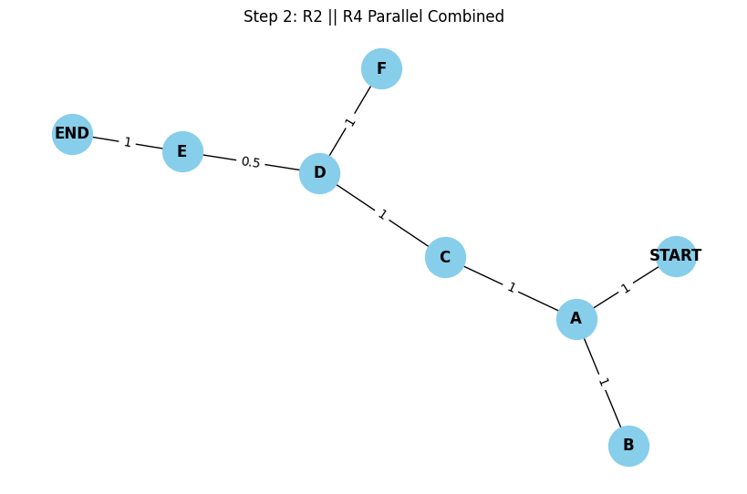

# Problem 1


---

#  Circuits Problem: Compute Equivalent Resistance Using Graph Theory

##  Introduction

Calculating the **equivalent resistance** between two nodes in a resistor network is fundamental in electrical engineering. As circuits become more complex, traditional simplification using only **series** and **parallel** rules becomes inefficient and error-prone. Graph theory offers a **systematic**, **scalable**, and **automatable** approach to this challenge.

---

##  Graph-Theoretic Approach

###  Modeling the Circuit

* **Vertices (nodes)** represent junctions.
* **Edges** represent resistors with a **weight** equal to their resistance value.
* **Objective**: Find the equivalent resistance between two distinguished nodes: `START` and `END`.

###  Mathematical Tools

* **Graph reduction** using simplification rules.
* **Resistor transformations**: Series, parallel, and sometimes Δ–Y (delta-wye) if needed.
* **Traversal methods**: DFS/BFS for pathfinding or component detection.
* **Edge contraction** and **node elimination** via Kirchhoff's laws.

---

##  Problem Setup (Based on Image)

###  Given Circuit

We are given the following circuit configuration:

* Resistors: $R_1, R_2, R_4, R_5, R_6, R_7$
* Nodes: `START` and `END`
* Key structures:

  * $R_2$ and $R_4$ are in **parallel**
  * That parallel block is in **series** with $R_7$
  * The block above is in **series** with two $R_6$ resistors
  * Entire path in **parallel** with a vertical $R_2$
  * Entire configuration is in **series** with $R_5$ between START and END

---

##  Step-by-Step Reduction

Let’s denote resistances:

* Let’s define:

  * $R_2 = x$
  * $R_4 = y$
  * $R_6 = z$
  * $R_5 = a$
  * $R_7 = b$

###  Step 1: Simplify Parallel $R_2 \parallel R_4$

$$
R_{24} = \left( \frac{1}{R_2} + \frac{1}{R_4} \right)^{-1}
= \left( \frac{1}{x} + \frac{1}{y} \right)^{-1}
$$

---

###  Step 2: Add $R_7$ in Series

$$
R_{\text{lower}} = R_{24} + R_7
= \left( \frac{1}{x} + \frac{1}{y} \right)^{-1} + b
$$

---

###  Step 3: Add Two $R_6$ in Series

$$
R_{66} = 2 \cdot R_6 = 2z
$$

$$
R_{\text{stack}} = R_{66} + R_{\text{lower}} 
= 2z + \left( \left( \frac{1}{x} + \frac{1}{y} \right)^{-1} + b \right)
$$

---

###  Step 4: Put the result in Parallel with $R_2$ (left vertical branch)

$$
R_{\text{bigparallel}} = \left( \frac{1}{x} + \frac{1}{R_{\text{stack}}} \right)^{-1}
$$

---

###  Step 5: Add $R_5$ in Series to Get Final Resistance

$$
R_{\text{eq}} = R_5 + R_{\text{bigparallel}} = a + \left( \frac{1}{x} + \frac{1}{2z + \left( \left( \frac{1}{x} + \frac{1}{y} \right)^{-1} + b \right)} \right)^{-1}
$$

This is the **final equivalent resistance** between START and END.



---

##  Full Pseudocode

```python
def equivalent_resistance(x, y, z, a, b):
    from sympy import symbols, simplify

    # Step 1: R2 || R4
    R24 = 1 / (1 / x + 1 / y)

    # Step 2: add R7
    R_lower = R24 + b

    # Step 3: R6 + R6
    R66 = 2 * z
    R_stack = R66 + R_lower

    # Step 4: parallel with vertical R2
    R_parallel = 1 / (1 / x + 1 / R_stack)

    # Step 5: add R5
    R_total = a + R_parallel
    return simplify(R_total)
```

---

##  Algorithm Analysis

| Feature         | Notes                                                                 |
| --------------- | --------------------------------------------------------------------- |
| **Scalability** | Efficient for sparse graphs using iterative reduction.                |
| **Complexity**  | Depends on detection of series/parallel: $O(n)$ to $O(n \log n)$.     |
| **Flexibility** | Adaptable to graphs with cycles and bridges (e.g., using star-delta). |

---


