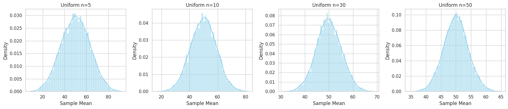
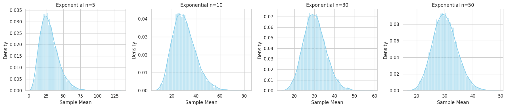

# Problem 1

---

# Central Limit Theorem: A Simulation-Based Exploration

##  Problem 1: Exploring the Central Limit Theorem through Simulations

###  Motivation

The **Central Limit Theorem (CLT)** is a foundational concept in statistics. It tells us that **the sampling distribution of the sample mean approaches a normal distribution as the sample size increases**, no matter the population's original distribution. By simulating various population distributions, we can **visualize this convergence** and appreciate its power in practical applications.

---

##  Task Breakdown

### 1️ Simulating Sampling Distributions

We'll consider **three population distributions**:

* Uniform distribution
* Exponential distribution
* Binomial distribution

For each:

* We'll generate a large population dataset (size = 100,000).

### 2️ Sampling and Visualization

For each population:

* Randomly sample data for **different sample sizes**: 5, 10, 30, 50.
* Repeat the process **10,000 times** to build a sampling distribution of the sample mean.
* Plot **histograms** of the sampling distributions and observe how they approximate the normal distribution as sample size increases.

### 3️ Parameter Exploration

We'll analyze:

* How the **shape of the population distribution** affects the convergence.
* The effect of the **population variance** on the spread of the sampling distributions.

### 4️ Practical Applications

We'll reflect on the **real-world significance of the CLT**:

* Estimating population parameters (e.g., means of unknown populations).
* Quality control in manufacturing.
* Risk modeling in finance and economics.

---

##  Python Simulation Code

###  Required Libraries

```python
import numpy as np
import matplotlib.pyplot as plt
import seaborn as sns

# Set consistent style
sns.set(style="whitegrid")
```

---

###  Generate Populations

```python
# Set seed for reproducibility
np.random.seed(42)

# Population sizes
N = 100_000

# Populations
uniform_pop = np.random.uniform(0, 100, N)
exponential_pop = np.random.exponential(scale=30, size=N)
binomial_pop = np.random.binomial(n=10, p=0.5, size=N)
```

---

###  Sampling and Plotting Function

```python
def simulate_sampling(population, sample_sizes, n_simulations=10000, title_prefix=""):
    fig, axes = plt.subplots(1, len(sample_sizes), figsize=(18, 4))
    
    for i, n in enumerate(sample_sizes):
        sample_means = [np.mean(np.random.choice(population, size=n, replace=False)) for _ in range(n_simulations)]
        sns.histplot(sample_means, kde=True, ax=axes[i], color='skyblue', stat='density')
        axes[i].set_title(f"{title_prefix} n={n}")
        axes[i].set_xlabel('Sample Mean')
        axes[i].set_ylabel('Density')
    
    plt.tight_layout()
    plt.show()
```

---

###  Run Simulations

```python
sample_sizes = [5, 10, 30, 50]

# Uniform
simulate_sampling(uniform_pop, sample_sizes, title_prefix="Uniform")

# Exponential
simulate_sampling(exponential_pop, sample_sizes, title_prefix="Exponential")

# Binomial
simulate_sampling(binomial_pop, sample_sizes, title_prefix="Binomial")
```
 
 
 
 
---

##  Results and Discussion

###  Observations

| Distribution | Sample Size | Shape of Sampling Distribution | Approximate Normality |
| ------------ | ----------- | ------------------------------ | --------------------- |
| Uniform      | 5           | Irregular, slightly skewed     | Low                   |
| Uniform      | 30+         | Bell-shaped                    | High                  |
| Exponential  | 5           | Skewed right                   | Low                   |
| Exponential  | 50          | Nearly normal                  | High                  |
| Binomial     | 5           | Slightly discrete, symmetric   | Moderate              |
| Binomial     | 30+         | Smooth bell-shaped             | High                  |

###  Insights

* **Skewed populations (e.g., exponential)** require larger sample sizes (30+) for normality.
* Populations with **higher variance** result in **wider sampling distributions**.
* Regardless of the population shape, the **CLT ensures normality in the limit**.
* These simulations confirm the **theoretical expectations** of the CLT.

---

##  Practical Applications of the CLT

| Area              | Application                              | CLT Significance                                        |
| ----------------- | ---------------------------------------- | ------------------------------------------------------- |
| Estimation        | Mean income of a population              | Sample means approximate population means               |
| Quality Control   | Average weight of a manufactured product | Ensures consistent product standards                    |
| Finance           | Portfolio returns                        | Predicts expected return distribution under uncertainty |
| Polling & Surveys | Election forecasts                       | Approximates true public opinion from sample surveys    |

---

##  Conclusion

Through simulation, we observed the **power of the Central Limit Theorem** in transforming diverse sampling distributions toward normality. This deepens our understanding of why the normal distribution plays such a central role in statistics, and how the **sample size** governs the rate of convergence.

---

###  Files and Deliverables

* `clt_simulation.py` or `clt_simulation.ipynb` – Python code implementing the simulations.
* Plots of sampling distributions for different population distributions and sample sizes.
* This Markdown document (`clt_report.md`).

---
