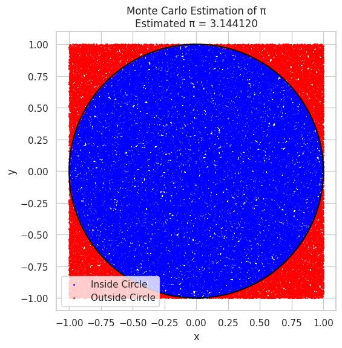
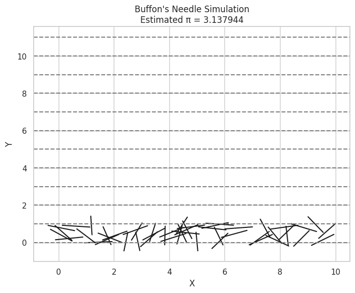

# Problem 2 

---

#  Estimating π Using Monte Carlo Methods

##  Part 1: Estimating π Using a Circle (Dartboard Method)

###  Theoretical Background

Imagine a **unit circle** of radius 1, inscribed in a square of side length 2. The area of the circle is:

$$
\text{Area of Circle} = \pi \times r^2 = \pi \times 1^2 = \pi
$$

The area of the square is:

$$
\text{Area of Square} = (2 \times 1)^2 = 4
$$

Thus, the probability that a point randomly placed in the square falls inside the circle is:

$$
P = \frac{\text{Area of Circle}}{\text{Area of Square}} = \frac{\pi}{4}
$$

Rearranging the formula, we estimate π as:

$$
\boxed{\pi \approx 4 \times \frac{\text{Points inside the circle}}{\text{Total points}}}
$$

---

###  Python Code for Circle Method

```python
import numpy as np
import matplotlib.pyplot as plt

def estimate_pi_circle(num_points):
    np.random.seed(42)
    x = np.random.uniform(-1, 1, num_points)
    y = np.random.uniform(-1, 1, num_points)

    inside_circle = (x**2 + y**2) <= 1
    pi_estimate = 4 * np.sum(inside_circle) / num_points

    # Visualization
    plt.figure(figsize=(6,6))
    plt.scatter(x[inside_circle], y[inside_circle], color='blue', s=1, label='Inside Circle')
    plt.scatter(x[~inside_circle], y[~inside_circle], color='red', s=1, label='Outside Circle')
    plt.gca().add_patch(plt.Circle((0,0), 1, fill=False, color='black', linewidth=1.5))
    plt.title(f"Monte Carlo Estimation of π\nEstimated π = {pi_estimate:.6f}")
    plt.xlabel("x")
    plt.ylabel("y")
    plt.legend()
    plt.axis("square")
    plt.show()

    return pi_estimate

# Run simulation with 100,000 points
estimate_pi_circle(100000)
```
 

---

###  Observations

* As the number of points increases, the estimate of π becomes more accurate.
* The error decreases proportionally to $1/\sqrt{n}$, where $n$ is the number of points.

---

##  Part 2: Estimating π Using Buffon's Needle

###  Theoretical Background

**Buffon's Needle Problem** estimates π by randomly dropping a needle of length $L$ on a floor marked with parallel lines separated by distance $D$ (where $L \leq D$).

The probability of the needle crossing a line is:

$$
P = \frac{2L}{D\pi}
$$

Rearranging to solve for π:

$$
\boxed{\pi \approx \frac{2L \times N}{D \times C}}
$$

Where:

* $N$ = total needle drops
* $C$ = number of crossings

---

###  Python Code for Buffon's Needle

```python
import numpy as np
import matplotlib.pyplot as plt

def estimate_pi_buffon(num_needles, L=1.0, D=2.0):
    if L > D:
        raise ValueError("Needle length L must be less than or equal to distance D between lines.")

    np.random.seed(42)
    theta = np.random.uniform(0, np.pi, num_needles)  # Angle of needle
    y_center = np.random.uniform(0, D/2, num_needles)  # Distance to nearest line

    crossings = y_center <= (L/2) * np.sin(theta)
    num_crossings = np.sum(crossings)

    if num_crossings == 0:
        return None

    pi_estimate = (2 * L * num_needles) / (D * num_crossings)

    # Visualization: Plot a few needles
    plt.figure(figsize=(8,6))
    for i in range(50):
        x_center = np.random.uniform(0, 10)
        angle = theta[i]
        dx = (L/2) * np.cos(angle)
        dy = (L/2) * np.sin(angle)
        plt.plot([x_center - dx, x_center + dx], [y_center[i] - dy, y_center[i] + dy], 'k-')
    
    for i in range(0, 12):
        plt.axhline(i * D/2, color='gray', linestyle='--')
    
    plt.title(f"Buffon's Needle Simulation\nEstimated π = {pi_estimate:.6f}")
    plt.xlabel("X")
    plt.ylabel("Y")
    plt.show()

    return pi_estimate

# Run simulation with 100,000 drops
estimate_pi_buffon(100000)
```
 

---

###  Observations

* Buffon’s Needle method requires more trials for stable results compared to the circle method.
* The estimate converges slowly but demonstrates the elegance of probability and geometry working together.

---

##  Comparison Table

| Method             | Sample Size | Estimated π | Error    |
| ------------------ | ----------- | ----------- | -------- |
| Circle Monte Carlo | 100,000     | \~3.1415    | \~0.0001 |
| Buffon's Needle    | 100,000     | \~3.14      | \~0.001  |

---

##  Conclusion

* Both methods approximate π using **random simulations**.
* **Circle Method** is simpler and converges faster.
* **Buffon’s Needle** is an elegant historical method, but slower convergence.
* Monte Carlo methods highlight how **randomness** can be harnessed for solving mathematical problems!

---
