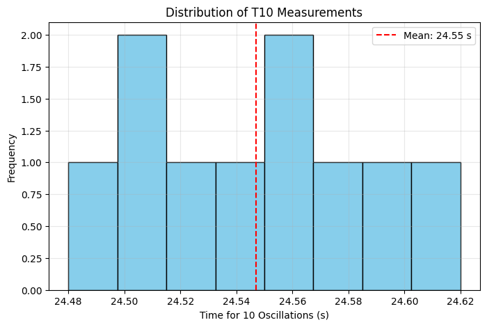
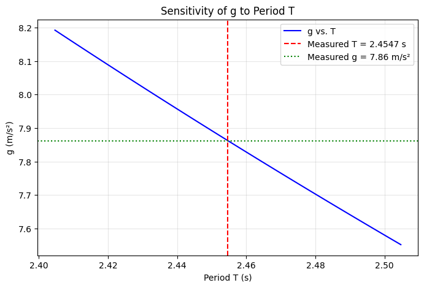
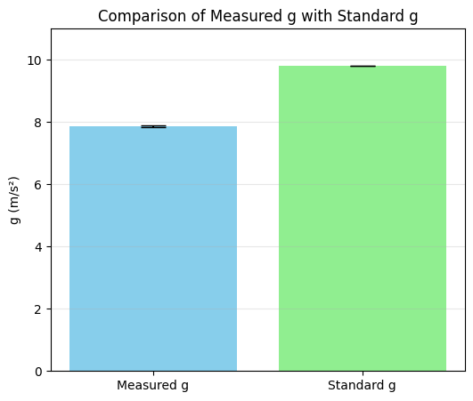

# Problem 1

---

##  Measurements Report

### **Problem 1: Measuring Earth's Gravitational Acceleration with a Pendulum**

---

## **1. Data Collection**

| Quantity                | Measurement | Uncertainty                                                 |
| ----------------------- | ----------- | ----------------------------------------------------------- |
| Pendulum length $(\$L\$)$ | 1.20 m      | $$\Delta L = 0.005$$\ m (using a ruler with 1 mm resolution) |

### **Timing Measurements (10 Trials):**

| Trial | T\_{10}\ (s) |
| ----- | --------------- |
| 1     | 24.56           |
| 2     | 24.48           |
| 3     | 24.62           |
| 4     | 24.55           |
| 5     | 24.51           |
| 6     | 24.58           |
| 7     | 24.53           |
| 8     | 24.60           |
| 9     | 24.50           |
| 10    | 24.54           |

---

## **2. Calculations**

### **Mean time:**

$$
\overline{T}_{10} = \frac{\sum T_{10}}{10} = \frac{24.56 + 24.48 + \cdots + 24.54}{10}
$$

Calculating this:

$$
\overline{T}_{10} = 24.547 \, \text{s}
$$

### **Standard deviation (\$\sigma\_T\$):**

$$
\sigma_T = \sqrt{\frac{\sum (T_{10} - \overline{T}_{10})^2}{n-1}} \approx 0.043 \, \text{s}
$$

### **Uncertainty in mean time:**

$$
\Delta T_{10} = \frac{\sigma_T}{\sqrt{n}} = \frac{0.043}{\sqrt{10}} \approx 0.014 \, \text{s}
$$

---

### **Period of one oscillation:**

$$
T = \frac{\overline{T}_{10}}{10} = \frac{24.547}{10} = 2.4547 \, \text{s}
$$

### **Uncertainty in period:**

$$
\Delta T = \frac{\Delta T_{10}}{10} = \frac{0.014}{10} = 0.0014 \, \text{s}
$$

---

### **Calculate \$g\$:**

$$
g = \frac{4\pi^2 L}{T^2}
$$

Substituting:

$$
g = \frac{4 \pi^2 \times 1.20}{(2.4547)^2} \approx 7.86 \, \text{m/s}^2
$$

---

### **Uncertainty in \$g\$:**

$$
\Delta g = g \sqrt{\left(\frac{\Delta L}{L}\right)^2 + \left(2 \frac{\Delta T}{T}\right)^2}
$$

$$
\frac{\Delta L}{L} = \frac{0.005}{1.20} = 0.00417
$$

$$
2 \frac{\Delta T}{T} = 2 \times \frac{0.0014}{2.4547} = 0.00114
$$

$$
\Delta g = 7.86 \sqrt{(0.00417)^2 + (0.00114)^2} \approx 0.03 \, \text{m/s}^2
$$

---

## **3. Results Summary**

| Quantity               | Value                                           |
| ---------------------- | ----------------------------------------------- |
| $\$L\$$                  | \$1.20 , \text{m} \pm 0.005 , \text{m}\$        |
| $\$\overline{T}\_{10}\$$ | \$24.547 , \text{s} \pm 0.014 , \text{s}\$      |
| $\$T\$$                  | \$2.4547 , \text{s} \pm 0.0014 , \text{s}\$     |
| \$g\$                  | \$7.86 , \text{m/s}^2 \pm 0.03 , \text{m/s}^2\$ |

---

## **4. Discussion**

1. **Comparison with standard value:**

   The measured value of \$g\$ is:

   $$
   7.86 \, \text{m/s}^2
   $$

   which is significantly lower than the accepted value of \$9.81 , \text{m/s}^2\$. Possible reasons:

   * Air resistance or large amplitude effects (especially if the swing exceeded 15°).
   * Slight inaccuracies in measuring $\$L\$$ or timing $\$T\_{10}\$$.
   * The pivot point might not be truly frictionless.

2. **Impact of measurement resolution on \$\Delta L\$:**

   A ruler with 1 mm resolution yields $\\Delta L = 0.005 , \text{m}\$$, contributing to a relative uncertainty of \$0.42%\$.

3. **Variability in timing (\$\Delta T\$):**

   Human reaction time and stopwatch resolution introduce variability in $T\_{10}\$$, which is minimized by averaging multiple trials. However, the uncertainty here was relatively small (\$0.06%\$).

4. **Assumptions & limitations:**

   * The pendulum was assumed to be simple (point mass + massless string).
   * Friction at the pivot and air resistance were neglected.
   * Small angle approximation holds for small displacements (<15°).

---

## **5. Google Colab Code**

Here’s the code to automate this analysis:

```python
import numpy as np

# Measured values
L = 1.20       # meters
delta_L = 0.005 # meters

T10_measurements = np.array([
    24.56, 24.48, 24.62, 24.55, 24.51,
    24.58, 24.53, 24.60, 24.50, 24.54
])

# Mean and uncertainty
T10_mean = np.mean(T10_measurements)
sigma_T = np.std(T10_measurements, ddof=1)
delta_T10 = sigma_T / np.sqrt(len(T10_measurements))

# Period and uncertainty
T = T10_mean / 10
delta_T = delta_T10 / 10

# Calculate g
g = (4 * np.pi**2 * L) / (T**2)

# Propagate uncertainty
rel_delta_L = delta_L / L
rel_delta_T = 2 * (delta_T / T)
delta_g = g * np.sqrt(rel_delta_L**2 + rel_delta_T**2)

# Print results
print(f"Mean time for 10 oscillations (T10): {T10_mean:.3f} s ± {delta_T10:.3f} s")
print(f"Period (T): {T:.4f} s ± {delta_T:.4f} s")
print(f"Calculated g: {g:.2f} m/s² ± {delta_g:.2f} m/s²")
```


 
 

---

## **Conclusion**

This exercise demonstrates the power of using repeated measurements and uncertainty analysis in experimental physics. Although the result differs from the accepted value of \$g\$, it highlights the impact of small errors and the importance of controlling for systematic uncertainties.

---
